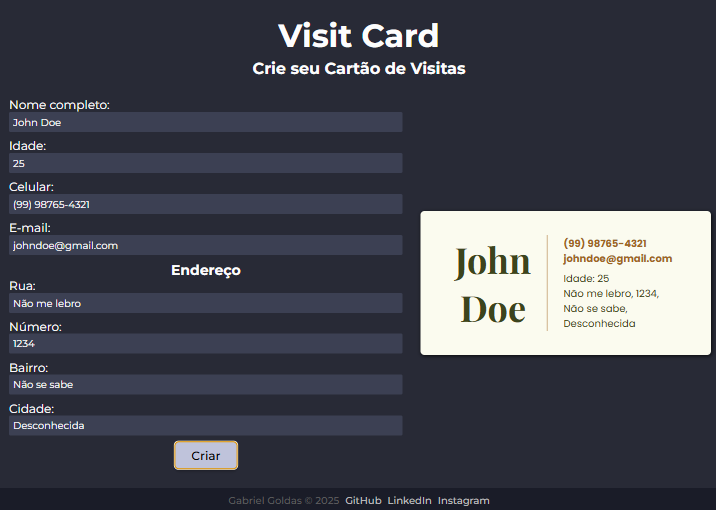

# VisitCard

This project was generated using [Angular CLI](https://github.com/angular/angular-cli) version 19.2.5.



---

# Cartão de Visitas Dinâmico

Este projeto cria um formulário dinâmico ee com validações em Angular para gerar cartões de visitas com informações personalizadas. O usuário insere dados como nome, idade, telefone, e-mail e endereço, e o sistema exibe um cartão de visitas formatado após o envio do formulário.

## Tecnologias Utilizadas

- **Angular**: Framework para criação da aplicação.
- **Reactive Forms**: Para gerenciar a validação e estrutura do formulário.
- **CSS**: Para estilização básica do projeto.
- **HTML**: Para estrutura do formulário e exibição dinâmica de dados.

## O Que Foi Aprendido

- **Uso de Reactive Forms**: Aprendeu-se a criar e validar formulários dinâmicos usando o módulo Reactive Forms do Angular.
- **Validação de Campos**: Implementação de validadores padrão e personalizados com o Validators.
- **Binding de Dados**: Integração dinâmica entre o formulário e o HTML para exibição de dados no cartão de visitas.
- **Estrutura Modular**: Utilização de componentes standalone para melhorar a organização do projeto.
- **Design Responsivo**: Adaptação de estilos para garantir que o cartão de visitas seja exibido corretamente em diferentes dispositivos.

## Funcionalidades

- Validação de campos como nome, idade, telefone, e-mail e endereço.
- Exibição dinâmica das informações inseridas no formato de cartão de visitas.
- Botão "Editar" para ajustar os dados após o envio.
- Design minimalista e pronto para personalizações.
- Formatação do campo de telefone com validação de padrões específicos.

## Como Executar

1. Clone o repositório.
2. Instale as dependências:
    ```bash
    npm install

3. Inicie o servidor de desenvolvimento:
    ```bash
    npm serve

4. Acesse o aplicativo no navegador:
    ```bash
    http://localhost:4200